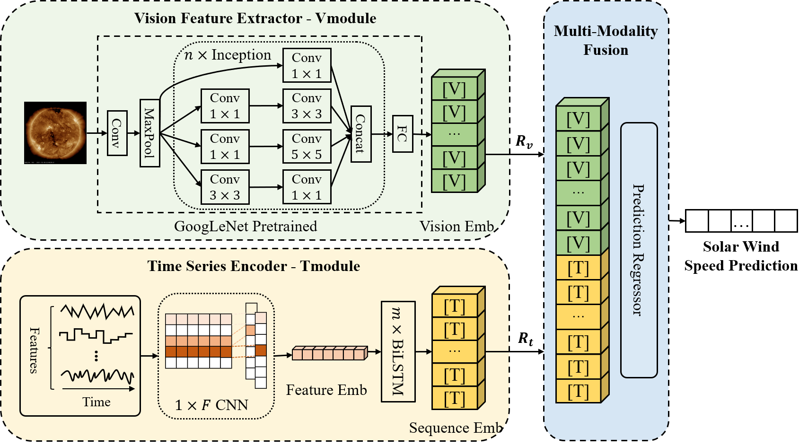

# Accurate Solar Wind Speed Prediction with Multimodality Information

[](https://spj.science.org/doi/epdf/10.34133/2022/9805707)    

This code is the official PyTorch implementation of our Space: Science & Technology'22 paper: [Accurate Solar Wind Speed Prediction with Multimodality Information](https://spj.science.org/doi/epdf/10.34133/2022/9805707).

🚩 News (2022.07) MMP has been accepted by Space: Science & Technology 2022.

## :sparkles: Abstract


When the solar wind passes over the Earth, it will cause geomagnetic storms, affect short-wave communications, and threaten the
safety of pipelines such as electricity and oil. Accurate prediction of the solar wind speed will allow people to make adequate
preparations to avoid wasting resources and affecting people’s life. Most existing methods only use single-modality data as
input and do not consider the information complementarity between different modalities. This paper proposes a multimodality
prediction (MMP) method that jointly learns vision and sequence information in a unified end-to-end framework for solar
wind speed prediction. MMP includes three modules: Vmodule, Tmodule, and Fusion module. Vmodule, which uses
pretrained GoogLeNet, is proposed to learn visual representations from the extreme ultraviolet (EUV) images. Tmodule
combining one-dimensional CNN with bidirectional long short-term memory (BiLSTM) is applied for learning sequence
representation from multivariate time series. Finally, a multimodality fusion method is applied to improve the overall
performance. We adopt the EUV images observed by the solar dynamics observatory (SDO) satellite and the OMNIWEB
dataset measured at Lagrangian point 1 (L1) to experiment. Comparative experiments have shown that the proposed MMP
achieves best performance in many metrics. The ablation experiments also verify the validity of each module and the
rationality of the hyperparameter setting.

## :sparkles: Datasets
You can obtain all the benchmarks from Google Drive 

- Solar Wind Series: https://drive.google.com/drive/folders/1st_0czEofqubJ_bgZ2nBLmUeLJH-ktnL.
- Solar EUV Images: https://drive.google.com/drive/folders/1TIlm6iWwzz-TDMaY-DNdT0eeb0bK0O5n?usp=sharing.

All the datasets are well pre-processed and can be used easily.

## :sparkles: How to Run the Code:

We provide the experiment scripts. Now you can reproduce the experiment results by:

```javascript
sh run.sh
```

## :sparkling_heart: Acknowledgements

The codes in this repository are inspired by the following:

- GoogleNet: [https://github.com/zhouhaoyi/Informer2020](https://www.cv-foundation.org/openaccess/content_cvpr_2015/papers/Szegedy_Going_Deeper_With_2015_CVPR_paper.pdf)
